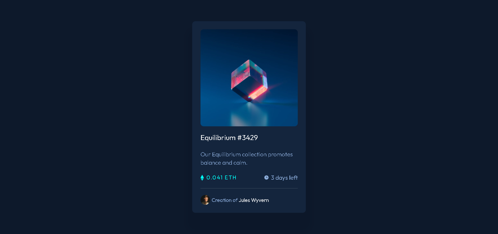
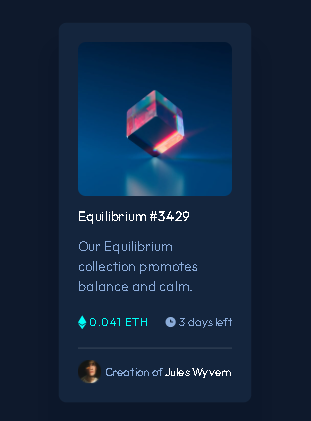

# NFT preview card component

- Live Site URL: [Live Site](https://nft-card-sunay.vercel.app/)

## Table of contents

- [Overview](#overview)
  - [The challenge](#the-challenge)
  - [Screenshot](#screenshot)
  - [Links](#links)
- [My process](#my-process)
  - [Built with](#built-with)
  - [Useful resources](#useful-resources)
- [Author](#author)

## Overview

### The challenge

Users should be able to:

- View the optimal layout depending on their device's screen size
- See hover states for interactive elements

### Screenshot

#### Desktop Screenshot

#### Mobile Screenshot

### Links

- Live Site URL: [Live Site](https://nft-card-sunay.vercel.app/)

## My process

### Built with

- Semantic HTML5 markup
- CSS custom properties
- Flexbox
- Mobile-first workflow

### Useful resources

- [StackOverflow](https://stackoverflow.com/questions/2941189/how-to-overlay-one-div-over-another-div/2941203#2941203) - This resource helped me to create overlay.

## Author

- LinkedIn [@fsunaycansev](https://www.linkedin.com/in/fsunaycansev/)
